## 1. Project Pipeline Overview

The project follows a **linear preprocessing pipeline (Notebooks 00–04)** that **branches into two independent analytical streams after EDA**, before **converging into the final integration notebook (Notebook 08)**:

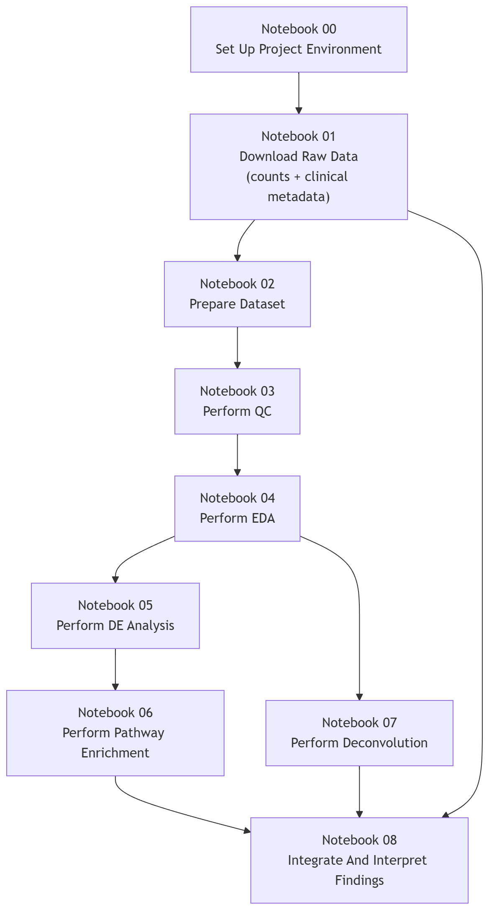{style="text-align: center;" width="50%"}

## 2. Project Notebooks

### 2.0. Notebook 00: Set Up Project Environment

-   **Established the project directory structure**

-   **Installed and verified all required R packages**

-   **Confirmed the computational environment**

This notebook is a **one-time setup** step with **no analytical outputs or figures**.

------------------------------------------------------------------------

### 2.1. Notebook 01: Download Raw Data

**Downloaded all raw data from TCGA-GBM** via the **GDC portal using `TCGAbiolinks`**:

-   **Unstranded raw counts matrix**: **Bulk RNA-seq gene expression counts** for **all available TCGA-GBM primary tumor samples**.
-   **Patient clinical metadata**: Survival times, vital status, age at diagnosis, Karnofsky performance scores, and paper-curated subtype labels; **used in Notebook 08** for **survival analysis**.

**No figures generated**.

------------------------------------------------------------------------

### 2.2. Notebook 02: Prepare Dataset

**Prepared the raw TCGA-GBM data** downloaded in Notebook 01 **for downstream analysis** using `TCGAbiolinks::GDCprepare()`:

-   Assembled the downloaded files into a **`SummarizedExperiment`** object
-   **Extracted** the **unstranded raw counts matrix** as the **expression data for all downstream analysis**
-   **Extracted** **tumor subtype information** (including **paper-curated Verhaak subtype labels,** **survival data**, and **clinical variables**) as **sample metadata**
-   **Extracted** **gene metadata** (**Ensembl IDs, gene names, gene biotypes**) for downstream filtering

**No figures generated.**

------------------------------------------------------------------------

### 2.3. Notebook 03: Perform QC

**Filtered the full TCGA-GBM dataset** to **180 primary tumor samples** **(55 Proneural, 125 Mesenchymal)** and **16,164 protein-coding genes**, applying:

-   **Subtype filtering:** **PN** and **ME** only
-   **Protein-coding gene filtering**
-   **Low-expression gene removal**: **`CPM > 1`** in **≥20% of the smaller group**
-   **MAD-based sample outlier removal**: **Library size** and **number of genes detected**

::: {layout="[[50, 50], [50, 50]]"}
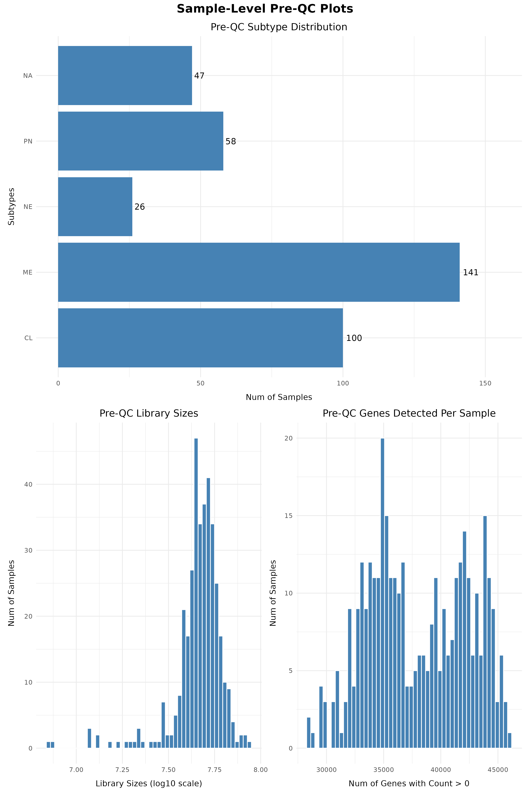{style="text-align: center;"}

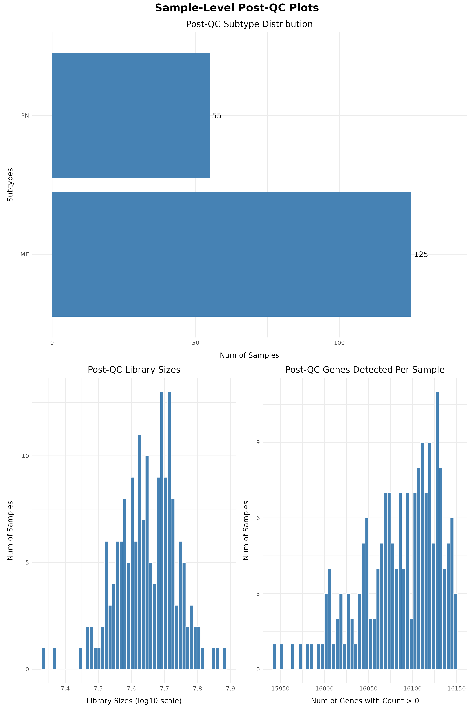{style="text-align: center;"}

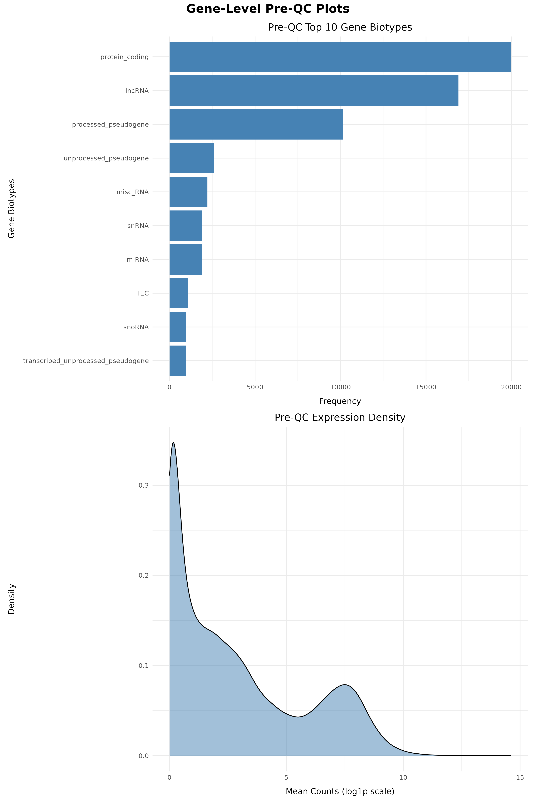{style="text-align: center;"}

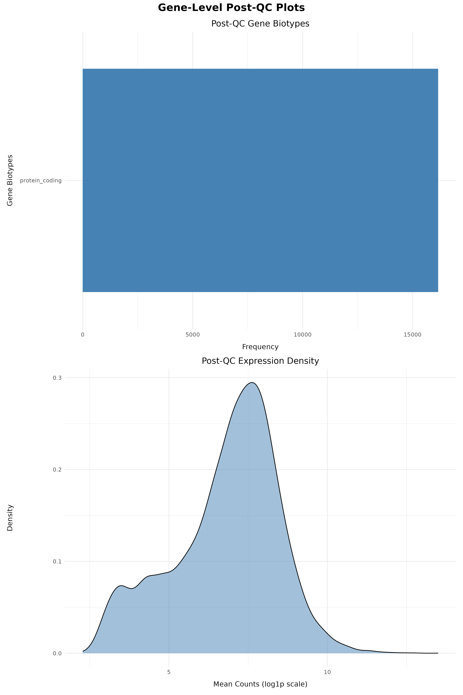{style="text-align: center;"}
:::

------------------------------------------------------------------------

### 2.4. Notebook 04: Perform EDA

Explored the **structure of the filtered (i.e. post-QC) dataset** using **Principal Component Analysis (PCA)** on the **top 500 most variable genes**, and performed **GO:BP and KEGG pathway enrichment** on the **top 10 genes driving each principal component** to interpret their biological meaning:

-   **PC1** **(largest source of variance)**: **Cell proliferation** axis. Genes driving PC1 are **enriched for cell cycle** and **chromosome segregation** terms.
-   **PC2**: **Neural identity** axis. Genes driving PC2 are **enriched for neural differentiation** and **synaptic signaling** terms.
-   **PC3**: **Mature neural subprogram**.

These PC-level biological themes **directly foreshadowed the subtype biology identified in the DE and pathway enrichment** **analyses** downstream.

::: {layout="[[33, 33, 33], [100]]"}
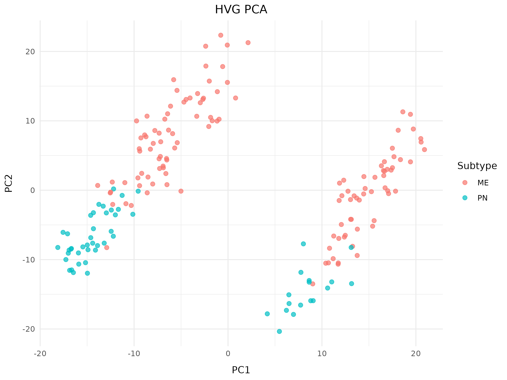{height="200px" style="text-align: center;"}

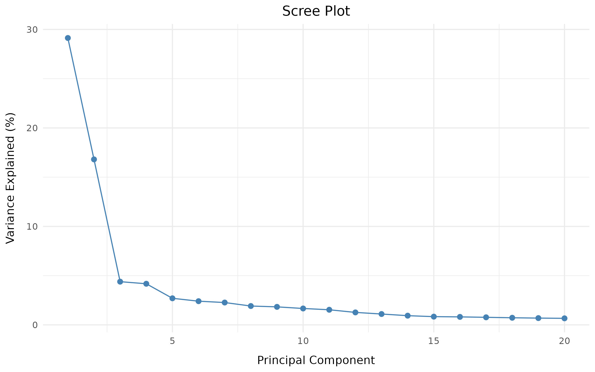{height="200px" style="text-align: center;"}

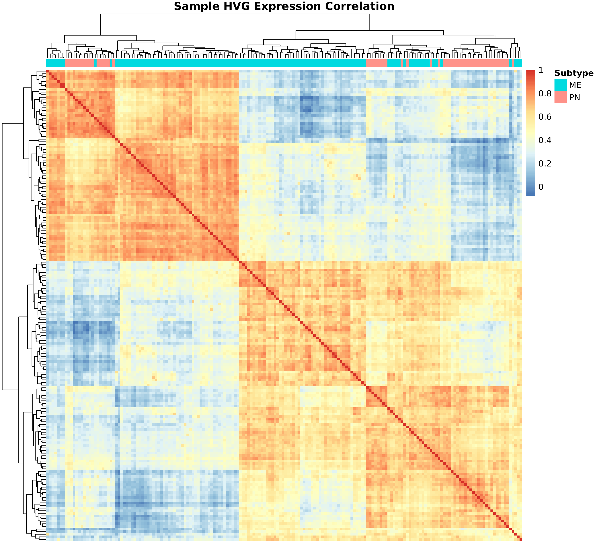{height="200px" style="text-align: center;"}

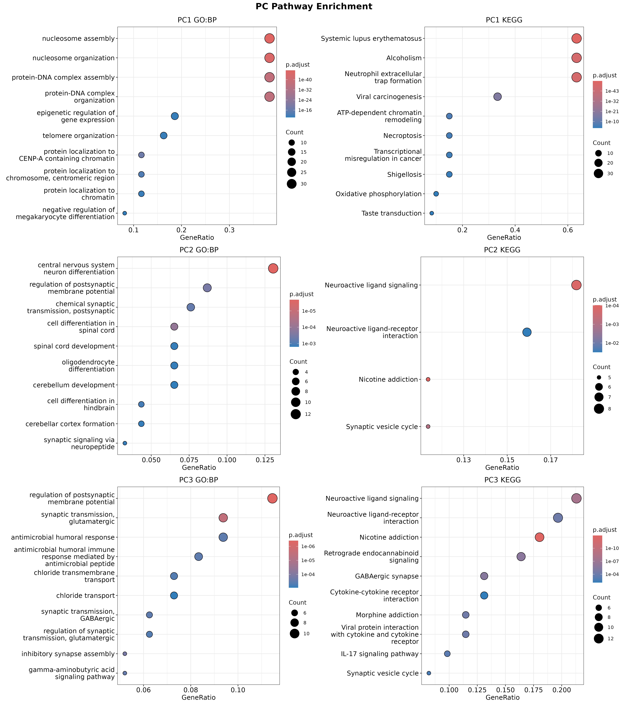{style="text-align: center;"}
:::

### 2.5. Notebook 05: Perform DE Analysis

**Identified genes differentially expressed between ME and PN** subtypes (ME vs PN, PN as reference) using **two independent methods**:

-   **DESeq2** **(primary)**:
    -   **Wald test**
    -   **`padj < 0.05`**
    -   **`|log2FC| > 1`**
-   **EdgeR** **(confirmatory)**:
    -   **QL** **F-test**
    -   **`FDR < 0.05`**
    -   **`|logFC| > 1`**

**\>94% consensus** between the two methods:

-   **1,528 genes upregulated in ME**

-   **1,130 genes downregulated in ME** (i.e. upregulated in PN) in the **intersections**.

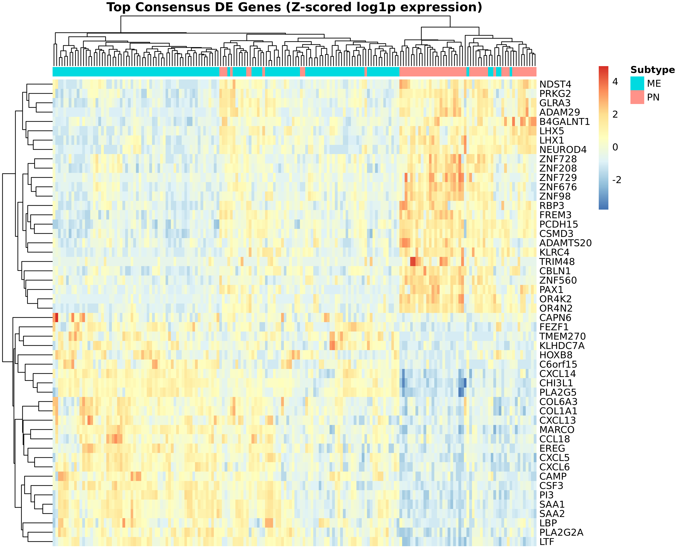{style="text-align: center;"}

::: {layout="[[50, 50]]"}
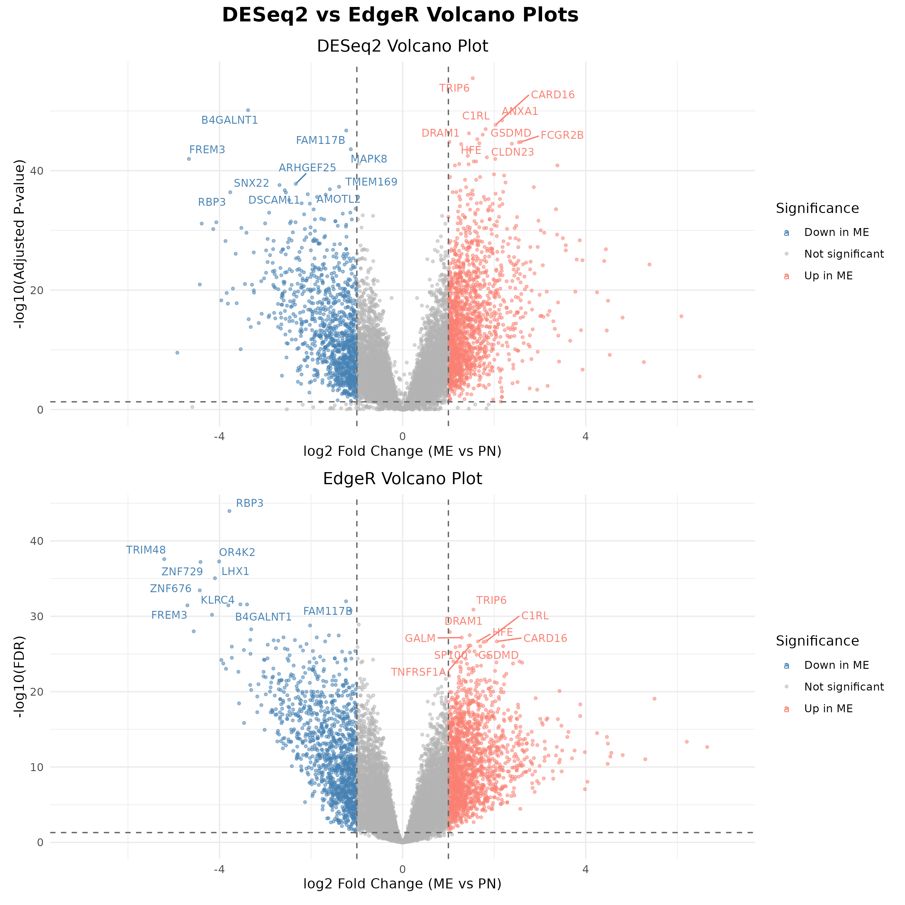{style="text-align: center;"}

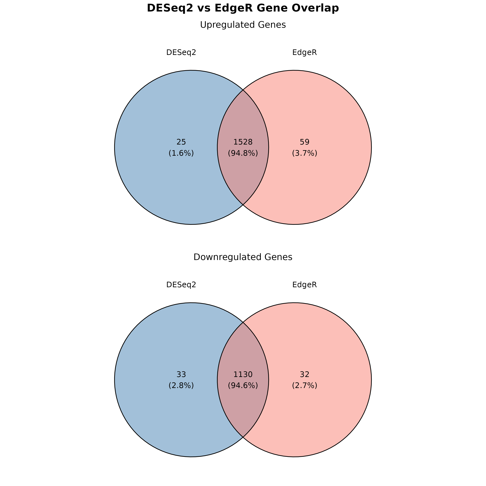{style="text-align: center;"}
:::

------------------------------------------------------------------------

### 2.6. Notebook 06: Perform Pathway Enrichment

**Identified biological pathways enriched among the DE genes** using **two complementary methods** against **two pathway databases (GO:BP and KEGG)**:

-   **ORA**: Tested the **consensus DE gene lists (upregulated and downregulated separately)** for **pathway overrepresentation**:
    -   **Hypergeometric test**
    -   **Benjamini-Hochberg (BH) correction**
    -   **`padj < 0.05`**
    -   **results were simplified using semantic similarity to remove redundant GO terms** (but **not KEGG**, as **its pathways represent independent, curated biochemical maps** rather than a hierarchical tree).
-   **GSEA**: Tested the **full ranked gene list** **(all 16,164 genes**, **ranked by signed DESeq2 Wald statistic** and **independently by signed EdgeR F-statistic)** for **coordinated rank shifts**
    -   **Benjamini-Hochberg (BH) correction**
    -   **`padj < 0.05`**
    -   **`eps = 0`**

**Both methods independently confirmed** the **same** two opposing **biological themes**:

-   **Upregulated in ME**: A **mesenchymal/wound-healing program**.

    -   **Immune cell recruitment** (leukocyte migration, cytokine signaling, adaptive immunity)
    -   **ECM (ExtraCellular Matrix) remodeling**
    -   Permanently active **inflammatory signaling**

    These pathways **collectively reflected the "wound that never heals" phenomenon** in cancer biology.

-   **Downregulated in ME (upregulated in PN)**: A **neural identity + cell proliferation program**.

    -   **ORA:**
        -   **Axonogenesis**
        -   **Synapse assembly**
        -   **CNS neuron differentiation**
    -   **GSEA:**
        -   **Chromosome segregation**
        -   **Nuclear division**
        -   **DNA damage response**

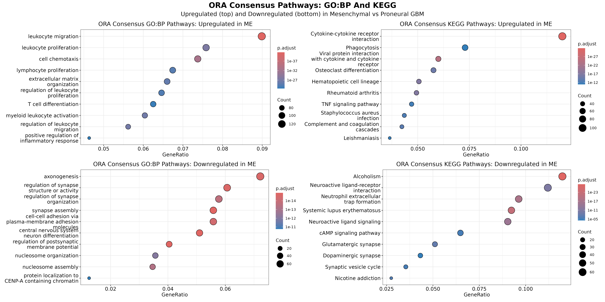{style="text-align: center;"}

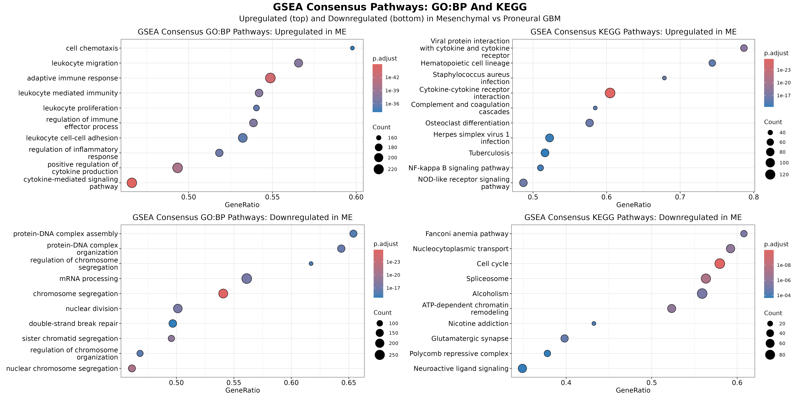{style="text-align: center;"}

### 2.7. Notebook 07: Perform Deconvolution

**Estimated the cellular composition of each tumor sample** from the bulk RNA-seq data using **MCPcounter** with **two custom GBM-specific marker gene sets**:

-   **Primary:**
    -   **Neftel neoplastic** states + **Moreno immune/stromal** types
    -   AC, MES, NPC, OPC neoplastic states
    -   TAM, Microglia, T cells, B cells, NK cells, DC, Monocytes, Mast cells, Mural cells, Endothelial cells, and others.
-   **Confirmatory:**
    -   **Moreno neoplastic** states + **Moreno immune/stromal** types
    -   **Independent validation of the primary results** using a **different neoplastic marker** **set**.

**Both sets** confirmed the **same cell composition differences between subtypes**:

-   **ME tumors**:
    -   Enriched for **MES-like neoplastic cells** and **broad immune/stromal infiltrate** (TAMs, microglia, T/B/NK cells, endothelial, mural cells)
    -   **Consistent** with the **mesenchymal/wound-healing program** identified in **Notebook 06**.
-   **PN tumors**:
    -   Enriched for **NPC/OPC-like neoplastic cells** and **neural cell types** (neurons, oligodendrocytes, radial glia
    -   **Consistent** with the **neural identity program** identified in **Notebook 06**.

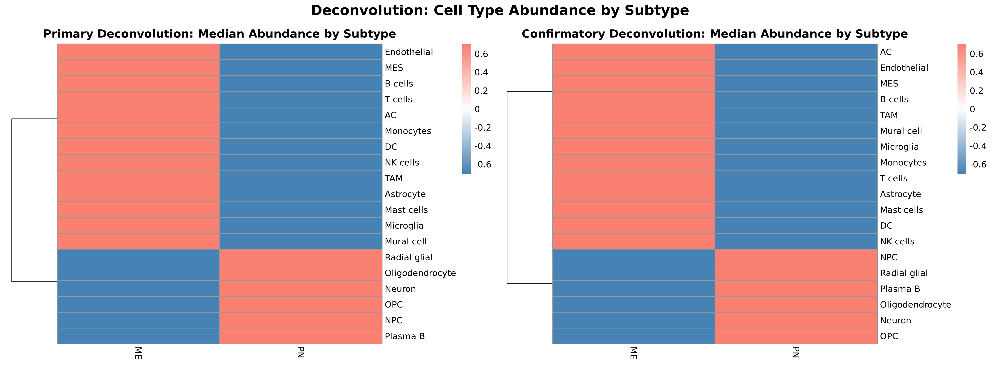{style="text-align: center;"}

### 2.8. Notebook 08: Integrate And Interpret Findings

The integration notebook **synthesized all upstream findings** into a **unified biological portrait of PN and ME GBM subtypes**, and **tested its clinical significance** via a **multivariate Cox proportional hazards model.**

------------------------------------------------------------------------

**Pathway-cell type integration**:

-   **Per-sample pathway activity scores (GSVA)** for **15 pathways across 3 biological themes** were **correlated against 19 cell type abundance scores**, computed **separately within ME and PN samples**.

-   The **correlation patterns were strikingly consistent across both subtypes**, confirming these relationships **reflect general GBM biology** rather than subtype-specific artifacts.

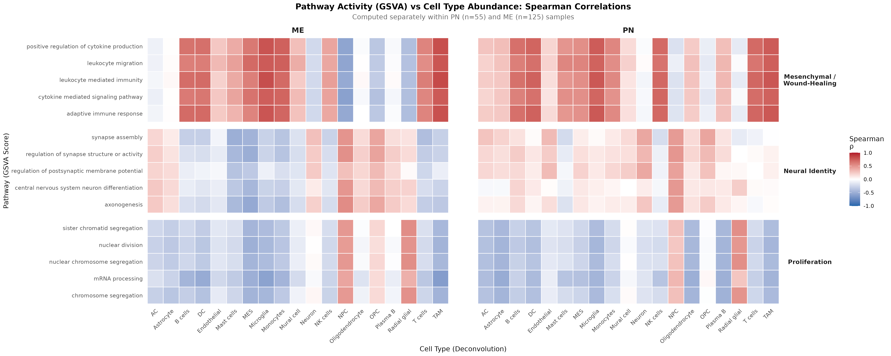{style="text-align: center;"}

------------------------------------------------------------------------

**Survival analysis**: A **Kaplan-Meier curve** confirmed a **statistically significant survival difference between subtypes (log-rank `p=0.033`)**, with **PN patients surviving longer on average**.

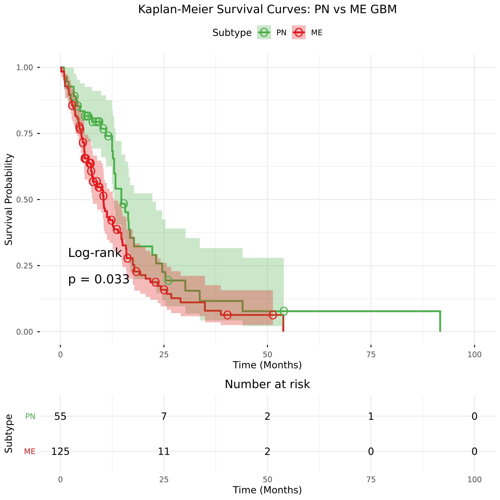{style="text-align: center;"}

------------------------------------------------------------------------

The multivariate **Cox proportional hazards model revealed** that:

-   **Age at diagnosis** is the **dominant predictor**

    -   **HR=1.046 per year**

    -   **`p=7.59e-08`**

-   followed by **positive regulation of cytokine signaling** pathway activity

    -   **HR=3.768**

    -   **`p=0.0457`**

-   **Subtype itself is NOT an independent predictor of survival** (HR=0.981, `p=0.958`) once biological variables are controlled for.

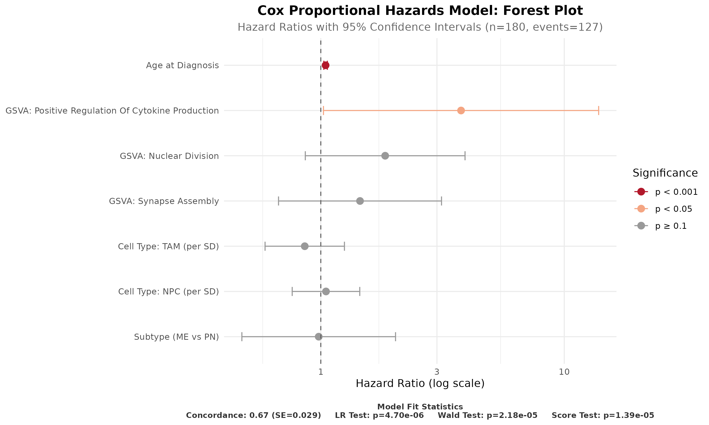{style="text-align: center;"}

------------------------------------------------------------------------

The **proportional hazards assumption was verified via Schoenfeld residuals** **(global `p=0.426`),** concluding that the **Cox model is statistically valid.**

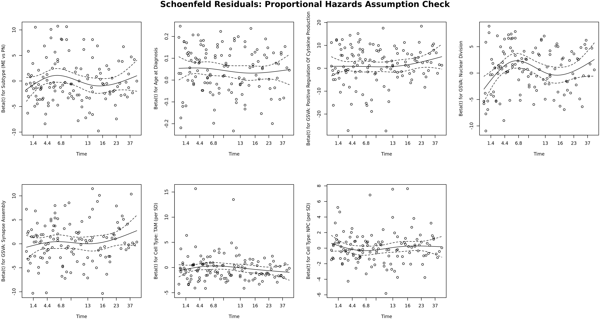{style="text-align: center;"}

------------------------------------------------------------------------

**Key insight**:

-   The **survival difference between ME and PN** subtypes visible in the KM plot is **mediated through biological variables**, particularly **age distribution** and **immune/inflammatory pathway activity**, rather than being a direct effect of the subtype label itself.

-   **It is NOT "being ME" that drives worse prognosis**, it is rather that the **biological characteristics that ME tumors tend to express do so.**
